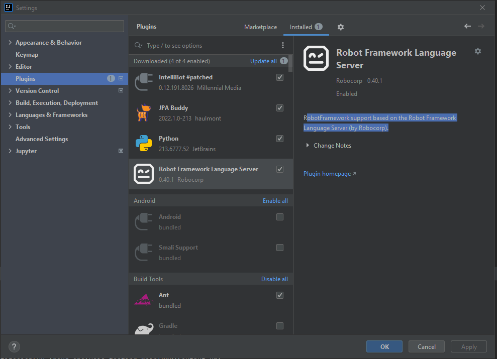

# RFProjectWithIntelliJ

## Instalación y Configuración RobotFramework

### Instalar Python:

Descarga e instalar Python:

 * https://www.python.org/downloads/

 * Versiones compatibles: 3.7 / 3.8 / 3.9+

Verificar la instalación de Python:

```bash
$ python --version
Python 3.9.7
```

### Instalar RobotFramwork:

Desde una consola, por ejemplo "cmd" o "gitbash":

```bash
$ pip install robotframework
```

Verificar la instalación de RobotFramework:

```bash
$ robot --version
Robot Framework 3.2.2 (Python 3.9.7 on win32)
```

### Instalar Selenium:

Desde una consola, por ejemplo "cmd" o "gitbash":

```bash
$ pip install robotframework-seleniumlibrary
```


## Notas de Instalación y Configuración:

Teniendo instalado IntelliJ, seguir los siguiente pasos de la web:

 * http://ha-phan.vn/rfw5-configure-pycharm-intellij-ide-to-run-robot-frameworks-testsuite-testcase/


## Screen de Instalación de Plugins:



## Repositorio del plugin con documentación adicional

 * https://github.com/lte2000/intellibot#readme
